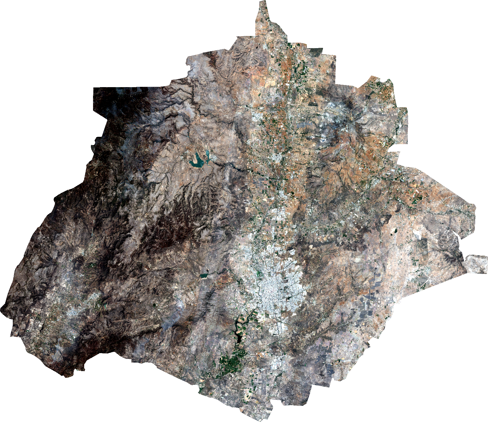

<!-- Generated by scripts/check_ags_raster.py. Do not edit by hand. -->

# Aguascalientes raster check (April 2024)

Sentinel-2 L1C median composite exported by `hydroscope.geo.gee_export`.

## Raster

- Source: `data/ags/raw/s2_ags_2024_04.vrt` (1 file(s))
- Size: 10723 x 9282 px, 14 bands, `uint16`
- CRS: EPSG:32613, pixel size: 10 m
- Pixel lattice compatible with the 640 m grid (origin a multiple of 10 m): yes
- First full 640 m cell at pixel offset: col 31, row 45

## Band statistics versus EuroSAT train

Statistics over pixels with `valid_obs > 0`, in digital numbers (reflectance x 10000).
EuroSAT percentiles are not available (only mean and std are stored), so each
Aguascalientes median is compared by its z-score `(median - EuroSAT mean) / EuroSAT std`;
bands with |z| > 2 are flagged. The last column is the fraction of pixels
within EuroSAT mean +/- 3 std. This is a screening heuristic: EuroSAT
covers other regions and land covers, so a flag asks for a visual check, not a failure.

| Band | Ags p2 | Ags median | Ags p98 | EuroSAT mean | EuroSAT std | z | Flag | Within 3 std |
| --- | ---: | ---: | ---: | ---: | ---: | ---: | :---: | ---: |
| B01 | 1063.0 | 1516.0 | 2068.0 | 1354.4 | 245.7 | 0.66 | ok | 98.2 % |
| B02 | 880.0 | 1435.0 | 2114.0 | 1118.2 | 333.0 | 0.95 | ok | 98.0 % |
| B03 | 800.0 | 1485.0 | 2229.0 | 1042.9 | 395.1 | 1.12 | ok | 98.0 % |
| B04 | 835.0 | 1799.0 | 2726.0 | 947.6 | 593.8 | 1.43 | ok | 98.0 % |
| B05 | 1045.0 | 1992.0 | 2894.0 | 1199.5 | 566.4 | 1.40 | ok | 98.0 % |
| B06 | 1320.0 | 2298.0 | 3266.0 | 1999.8 | 861.2 | 0.35 | ok | 100.0 % |
| B07 | 1466.0 | 2499.0 | 3622.0 | 2369.2 | 1086.6 | 0.12 | ok | 100.0 % |
| B08 | 1484.0 | 2519.0 | 3675.0 | 2296.8 | 1118.0 | 0.20 | ok | 100.0 % |
| B09 | 850.0 | 1291.0 | 1750.0 | 732.1 | 404.9 | 1.38 | ok | 99.6 % |
| B10 | 20.0 | 44.0 | 159.0 | 12.1 | 4.8 | 6.68 | FLAG | 9.3 % |
| B11 | 1900.0 | 3322.0 | 4558.0 | 1819.0 | 1002.6 | 1.50 | ok | 99.4 % |
| B12 | 1265.0 | 2575.0 | 3698.0 | 1118.9 | 761.3 | 1.91 | ok | 93.3 % |
| B8A | 1651.0 | 2741.0 | 3948.0 | 2594.1 | 1231.6 | 0.12 | ok | 100.0 % |

Flagged bands (|z| > 2): B10.

## `valid_obs`

Count of cloud-free observations per pixel (QA60 bits 10 and 11 masked).

- Pixels with `valid_obs` > 0: 56235986 of 99530886
- No boundary given (`--boundary`): outside-state pixels and in-state pixels without observations are not distinguishable; `valid_obs == 0` is used as a proxy over all pixels of the raster.
- min / median / max over all pixels (proxy): 0 / 5.0 / 26
- Pixels with `valid_obs` == 0 among all pixels (proxy): 43294900 (43.50 %)
- Over pixels with `valid_obs` > 0: min / median / max = 4 / 11.0 / 26; area 5623.6 km2

| `valid_obs` | Pixels | Share of valid pixels |
| ---: | ---: | ---: |
| 4 | 384804 | 0.68 % |
| 5 | 10300160 | 18.32 % |
| 6 | 14439340 | 25.68 % |
| 7 | 205284 | 0.37 % |
| 8 | 319673 | 0.57 % |
| 9 | 353661 | 0.63 % |
| 10 | 1417184 | 2.52 % |
| 11 | 10087457 | 17.94 % |
| 12 | 10845019 | 19.28 % |
| 13 | 2999479 | 5.33 % |
| 14 | 277696 | 0.49 % |
| 15 | 7 | 0.00 % |
| 16 | 288747 | 0.51 % |
| 17 | 11 | 0.00 % |
| 18 | 23963 | 0.04 % |
| 19 | 105 | 0.00 % |
| 20 | 386580 | 0.69 % |
| 21 | 4524 | 0.01 % |
| 22 | 1027164 | 1.83 % |
| 23 | 14204 | 0.03 % |
| 24 | 1930931 | 3.43 % |
| 25 | 1654 | 0.00 % |
| 26 | 928339 | 1.65 % |

## Warnings

- Bands with |z| > 2 versus EuroSAT: B10. Inspect the preview and the histograms before labeling.
- 43.50 % of raster pixels have no cloud-free observation.

## Preview

